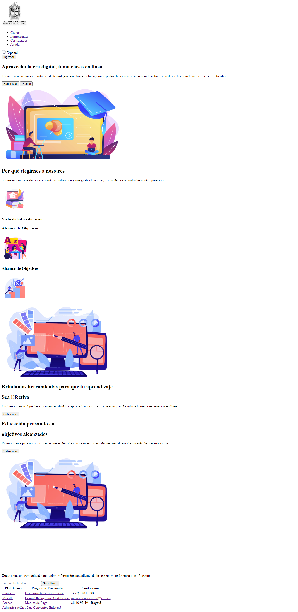
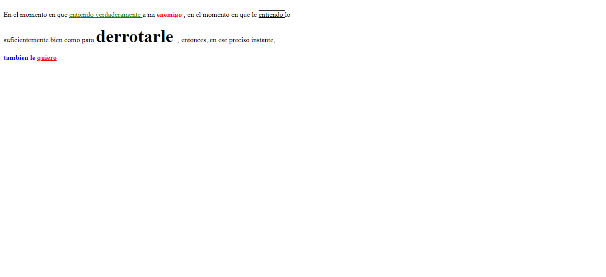
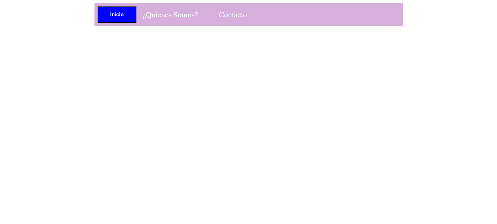

<h1>Taller # 9 : Carlos Galván </h1>

<h2>Información </h2>
    
Curso: Full Stack Básico - Grupo 1 

    
Profesor: Cristian Patiño
  

<h2> Punto 1: Link de Figma </h2>
<a href="https://www.figma.com/file/ALHv5pzMZbcwiEOIFUSiM2/Carlos-Galvan---Figma?type=design&t=dxTMuQlCGFCHkSUh-1"> Link de Figma </a>

 

<a href ="https://cjgalvan.github.io/taller-9-full-stack/"> Link Pagina </a>

<h2>Punto 2: HTML</h2>

<h2>Punto 3: CSS</h2>

<h2> Punto 4: </h2>

<h2> Punto 5: </h2>

<h2> Punto 6: </h2>

<h2> Punto 7 - 8: </h2>

<h2> Punto 9: </h2>

